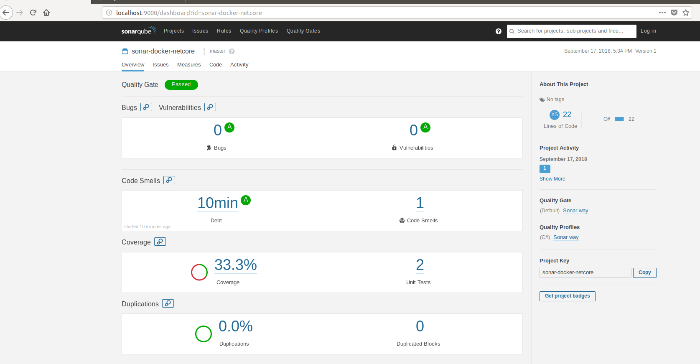

## Welcome to GitHub Pages

This repo demonstrates how to configure sonarqube and postgres in docker. It also shows how to write a multi-stage Dockerfile for .net core app that can publish code coverage stats to sonarqube.

You can use the [editor on GitHub](https://github.com/nur858/sonarqube-netcore-docker/edit/master/README.md) to maintain and preview the content for your website in Markdown files.

Whenever you commit to this repository, GitHub Pages will run [Jekyll](https://jekyllrb.com/) to rebuild the pages in your site, from the content in your Markdown files.

### Prerequisites
The demo application uses nunit for unit testing and [coverlet](https://github.com/tonerdo/coverlet) for code coverage data.

